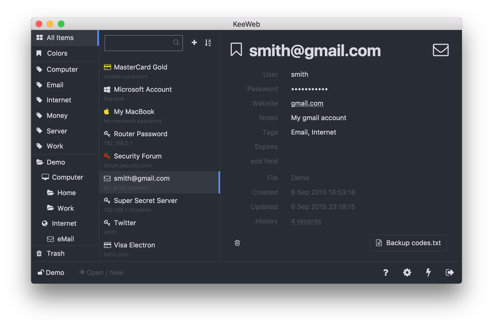

# Free cross-platform password manager compatible with KeePass and Ethereum

This webapp is a browser and desktop password manager compatible with KeePass databases. It doesn't require any server or additional resources.
The app can run either in browser, or as a desktop app.



# Quick Links

Apps: [Web](https://app.keeweb.info/), [Desktop](https://github.com/keeweb/keeweb/releases/latest)  
Timeline: [Release Notes](release-notes.md), [TODO](https://github.com/keeweb/keeweb/wiki/TODO)  
On one page: [Features](https://keeweb.info/#features), [FAQ](https://github.com/keeweb/keeweb/wiki/FAQ)  
Website: [keeweb.info](https://keeweb.info)  
Twitter: [kee_web](https://twitter.com/kee_web)  

# Status

The app is already rather stable, so basic stuff should work.  
Project roadmap with planned features and approximate schedule is on [TODO](https://github.com/keeweb/keeweb/wiki/TODO) page.

# Self-hosting

Everything you need to host this app on your server is any static file server. The app is a single HTML file + cache manifest (optionally; for offline access).
You can download the latest distribution files from [gh-pages](https://github.com/keeweb/keeweb/archive/gh-pages.zip) branch.  

If you are using Docker:

1. put your dh.pem, cert.pem, key.pem to /etc/nginx/external/
2. run this script:
```bash
docker run --name keeweb -d -p 443:443 -p 80:80 -v $EXT_DIR:/etc/nginx/external/ antelle/keeweb
```

To make Dropbox work in your self-hosted app, [go to this Wiki page](https://github.com/keeweb/keeweb/wiki/Dropbox-and-GDrive).

# Building

The app can be built with grunt: `grunt` (html file will be in `dist/`).    
Desktop apps are built with `grunt desktop`. This works only in macOS as it builds dmg; requires wine.  
Also, a hardware token is required.  

To run Electron app without building an installer, build the app with `grunt` and start it this way:
```bash
grunt dev
npm run-script electron
```

For debug build:

1. run `npm install`
2. run `grunt dev --skip-sign --force`
3. open `http://localhost:8085/tmp`
Make sure your metamask and ganache is running
